# GPS Triangle World Masters, Oschatz 2026

**A single-file coaching report for one RC glider pilot, built from the public GPS telemetry of a world championship, with human direction and AI implementation via [Claude Code](https://docs.anthropic.com/en/docs/claude-code).**

<p align="center">
  <code>17 rounds</code>&nbsp;&nbsp;&middot;&nbsp;&nbsp;<code>38 pilots</code>&nbsp;&nbsp;&middot;&nbsp;&nbsp;<code>~1 Hz GPS for every flight</code>&nbsp;&nbsp;&middot;&nbsp;&nbsp;<code>one 2.7 MB HTML file</code>
  <br>
  <code>100% agent-written code</code>&nbsp;&nbsp;&middot;&nbsp;&nbsp;<code>247 tests</code>&nbsp;&nbsp;&middot;&nbsp;&nbsp;<code>85 captioned figures</code>
</p>

<p align="center">
  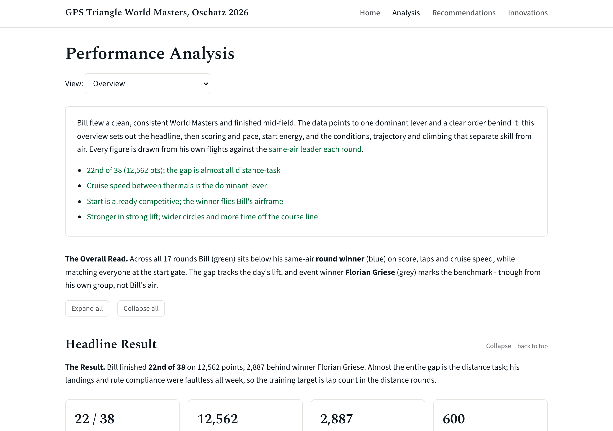
</p>

**View the report:** [open it in your browser](https://htmlpreview.github.io/?https://github.com/tmaisey/gps-triangle-world-masters-oschatz-2026/blob/main/report/gps-triangle-world-masters-oschatz-2026.html) (works on a phone), or download [`report/gps-triangle-world-masters-oschatz-2026.html`](report/gps-triangle-world-masters-oschatz-2026.html) and open it offline. Everything is inlined: data, charts, fonts.

---

## Contents

| Section | Key insight |
|---------|-------------|
| [The Premise](#the-premise) | A father's championship result, a public API with full flight tracks, and a question: where does the time go? |
| [Key Insights](#key-insights) | Cruise speed between thermals is the lever. Climbs are second. Turns and landings are already strengths. |
| [What Was Built](#what-was-built) | Four pages in one file: Home, Analysis (overview plus 17 round views), Recommendations, Innovations |
| [Design](#design) | White page, restrained palette, serif display type, every figure captioned, every claim grounded |
| [Recommendations](#recommendations) | Five training themes ordered by how much score each would move |
| [Innovations](#innovations) | From a post-flight AI coach to a navigator display, each weighed against the class rules |
| [How It Was Made](#how-it-was-made) | Intent captured first, reconciliation tests instead of unit tests, a six-reviewer build review before acceptance |
| [Data and Analysis](#data-and-analysis) | Fetch, reconcile, decompose each flight into phases, join the weather, emit a compact dataset |
| [Project Structure](#project-structure) | Where things live and how to rebuild the report |

---

## The Premise

Bill Maisey flies GPS Triangle, a radio-controlled gliding discipline where pilots fly as many laps of a triangular course as they can in a 30-minute task. The motor is used only to climb to the start; after that the flight is a pure glide, and staying aloft means finding thermals. Laps decide the score, average speed breaks ties, and a clean landing adds points.

In August 2026 he flew the Sport-class World Masters at Oschatz, Germany, and finished 22nd of 38. The organisers publish results on [rcmodelspot.com](https://rcmodelspot.com), and its open API exposes not just scores but the full one-hertz GPS track of every pilot in every round: position, altitude, vario, ground speed, bearing.

That made a different kind of question possible. Not "where did he finish" but "in which part of the flight does he lose time to the pilot who won his group, and what should he practise". This repository is the answer: a data pipeline, an analysis, and a single self-contained HTML report he can open on his phone.

---

## Key Insights

The like-for-like benchmark throughout is the **same-air leader**: the pilot who topped Bill's own heat group each round, flying the same slot in the same air. Scores are normalised to 1000 within each group, so this is the fair comparison, and the report says so wherever it matters.

**The gap is almost entirely the distance task.** Bill finished 2,887 points behind the winner. Of that, 2,197 points came from the 14 distance rounds and 690 from the three one-lap speed sprints. Landings and penalties contributed nothing: he scored the full 600 on every distance round and flew a clean week.

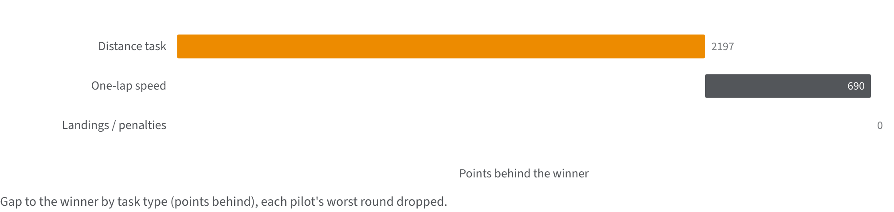

**Cruise speed between thermals is the dominant lever.** On clean laps Bill cruises at 61.9 km/h to his group leader's 67.4 km/h, about 8% slower. That accounts for roughly 90% of his 22-second-per-lap deficit and, through a pace counterfactual, about 2.7 of the 3 laps he typically gives up per round.

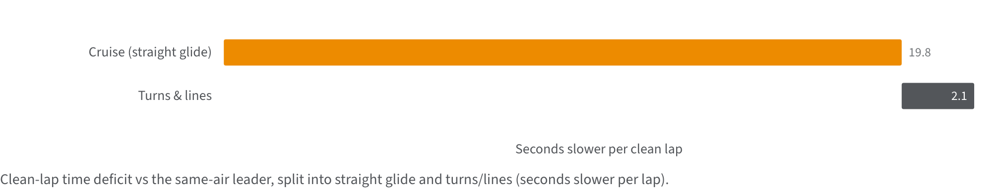

**Climb quality is second.** He spends less total time circling than the leader (287 s to 402 s), so he is not over-thermalling. But he banks about 35% less height per thermal (40.7 m to 63.1 m) in wider, slower circles. On days when lift is scarce that shows up as an early landing: three laps in Round 9, two in Round 12.

**The start is under-used, and cheap to fix.** He crosses the start gate at 70.8 km/h against a leader at 94.5 km/h and a regulation cap of 120 km/h. Entry altitude is already at the cap. The unused speed is free energy for the opening lap.

**Turns and lines are near a strength.** Turnpoint technique costs about two seconds a lap, a tenth of the deficit. Pooled over all 14 distance rounds, the winners hold a tighter line to the course by default but are far more willing to range off it when it pays: they spend 5.9% of flight time more than 300 m from the triangle against Bill's 1.9%.

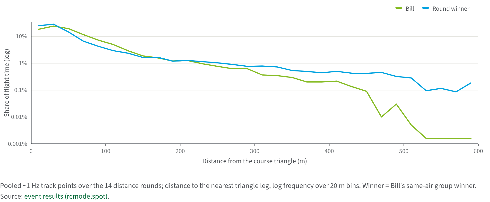

**Conditions matter, but not wind.** His within-group score rises with solar radiation (Spearman rho about +0.54 over the 14 distance rounds) and shows no association with wind. He is competitive when lift is strong and relatively weaker when it is scarce, which points back at the climb lever. The report presents this as a direction, not a significance claim.

**The ceiling is there.** In Rounds 7 and 17 he matched his group leader lap for lap and scored 998 and 999.

---

## What Was Built

One HTML file with four pages, switched by a small amount of JavaScript. No framework, no build tool, no network requests when it opens.

<table>
<tr>
<td width="50%">

**Analysis: Overview.** A summary panel of linked key points, then four sections: Headline Result; Scoring, Laps and Speed; Start Energy; Conditions, Trajectory and Climbing. Each insight is a title, the point, the evidence, and what to do about it.
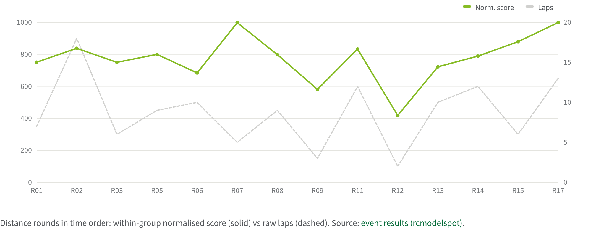

</td>
<td width="50%">

**Analysis: 17 round views.** A dropdown swaps in each round. Every view opens with a dashboard: score against the group, entry speed and altitude against the regulation caps, average speed, laps, rank, wind and a solar-radiation lift proxy.
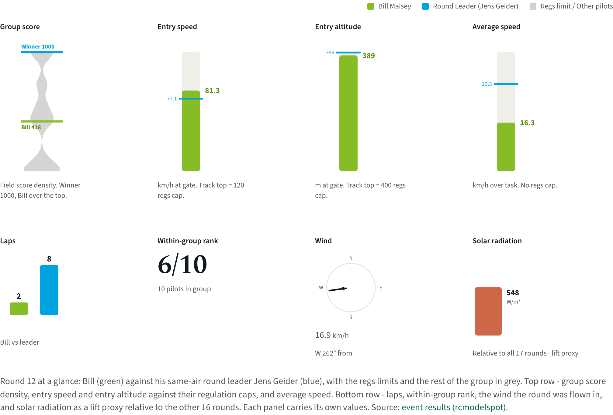

</td>
</tr>
<tr>
<td width="50%">

**Energy management.** Altitude and ground speed on one run-relative time axis, both pilots overlaid, so the reader can see where height was spent and where it was found.
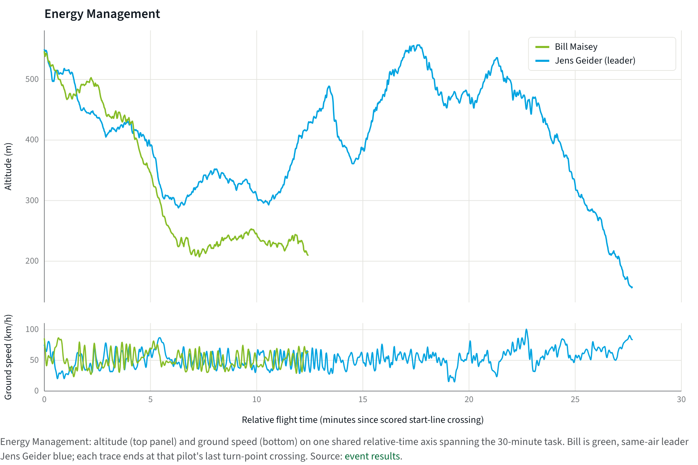

</td>
<td width="50%">

**Ground track and course.** Full-resolution traces over the reconstructed course triangle, with a north arrow, a scale bar and the wind vector placed at the clockface position it blows from. Round 12 is the worked example: two laps to the leader's eight, the extra distance all in loops that never connected.
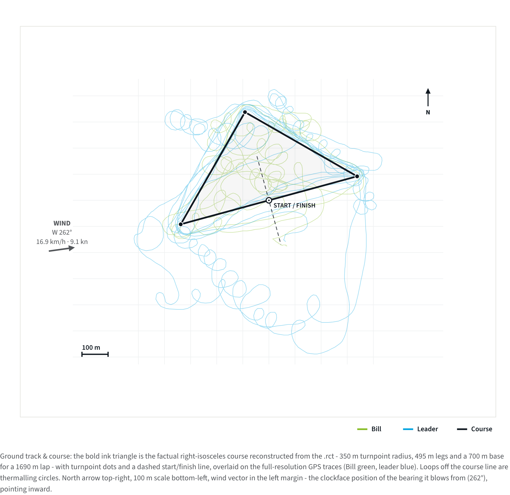

</td>
</tr>
<tr>
<td width="50%">

**Recommendations.** Every recommendation from the Analysis page gathered into five themes, each linking back to its evidence and forward to any matching innovation.
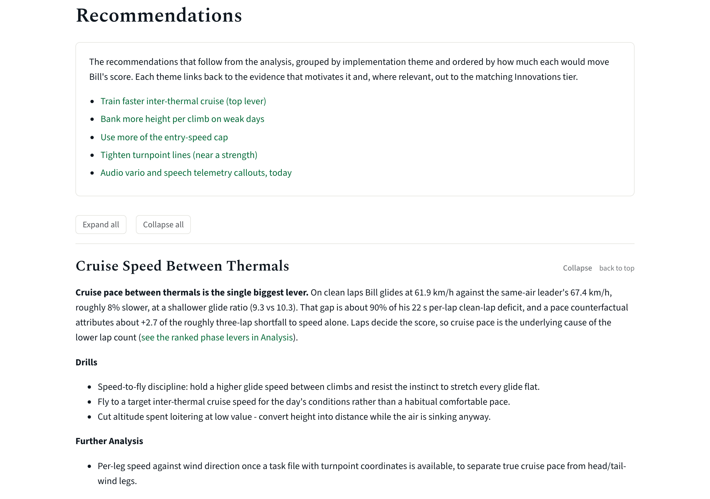

</td>
<td width="50%">

**Innovations.** The coaching-technology roadmap, framed by what the Sport-class regulations permit.
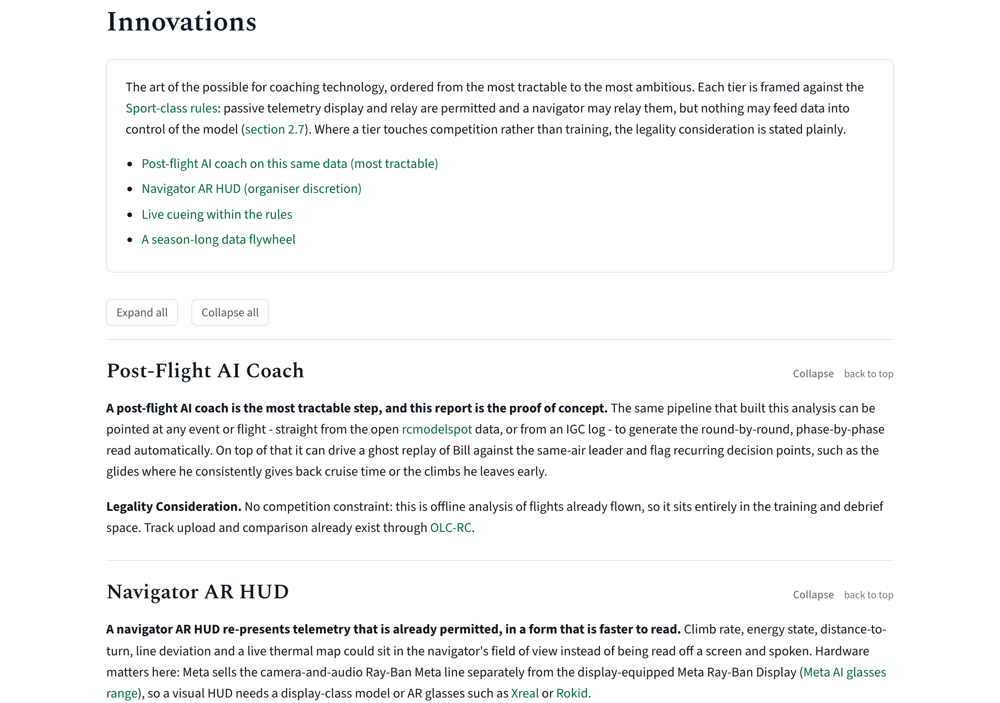

</td>
</tr>
</table>

The file also works on a phone: the navigation collapses to a burger menu, sections collapse and expand, and charts scroll sideways inside their own frame below 720 px so axis labels stay legible.

<p align="center">
  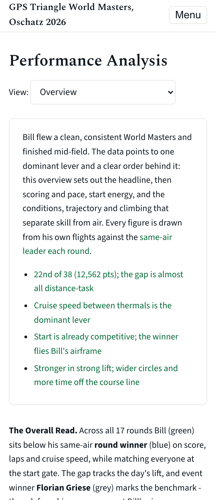
</p>

---

## Design

The brief was a report that reads as analysis, not as a dashboard template. White background. A restrained palette of green for Bill, blue for the round leader, greys for the field and the regulation limits, with one amber reserved for the dominant loss component. Spectral for headings, Source Sans 3 for body text, both inlined as base64 so the file looks the same offline.

Some rules were fixed at the start and enforced by tests:

- **Every figure captioned.** 85 figures, 85 captions, each stating what is plotted and where the data comes from.
- **Every claim grounded.** A plot on the page, a link to the source data, or both. External links are checked against an allowlist.
- **Point, evidence, explanation.** Each insight opens with the point, shows the evidence, then explains what to do.
- **No decoration.** No coloured accent bars on boxes, no gradient banners, no emojis.
- **Plain language.** A short list of phrases the report may not use, swept by test.

Chart geometry is deterministic Python emitting inline SVG. Rebuilding the report twice produces byte-identical output, which is what makes the review workflow below possible.

---

## Recommendations

Five themes, ordered by how much each would move the score. The full set with drills, further analysis and links lives on the Recommendations page; this is the shape of it.

| Theme | The lever | What to practise |
|-------|-----------|------------------|
| Cruise speed between thermals | ~90% of the lap-time deficit | Hold a higher glide speed between climbs; fly to a target cruise speed for the day rather than a habitual pace |
| Climb quality | Height banked per thermal, 35% below the leader | Tighter, better-centred circles; commit to weak cores instead of leaving to search |
| Entry speed | 49 km/h of the 120 km/h cap unused | Carry gate speed up toward the cap; time the dive so peak speed lands on the line |
| Turnpoint lines | ~2 s per lap | Smallest lever; keep it a strength |
| Rules-legal live signals | Available today | Audio vario tuning, speech telemetry callouts, a navigator on the ground station |

A separate weakness, the one-lap speed sprint (about 110 km/h against about 150 km/h for the best), is noted and kept apart from the distance-task story.

---

## Innovations

The forward-looking section asks what coaching technology the rules would allow. Four tiers, from the tractable to the ambitious: a post-flight AI coach that reads the same telemetry this report used; a navigator display for the helper on the ground; live cueing during the flight; and the data flywheel that a season of flights would create.

Each tier carries a legality consideration against the [Sport-class regulations](https://gps-triangle.net/assets/files/regulations_sport_en_V1.9_release01.pdf). Passive telemetry display and audio vario are explicitly permitted. Nothing may feed data into control of the model. A pilot-worn heads-up display is safest as a training tool; in competition it is a decision for the contest director.

---

## How It Was Made

The whole build ran as a conversation between one person setting direction and Claude Code implementing, with the orchestrating agent delegating research, data pulls, page builds and reviews to subagents so its own context stayed clean.

**Intent first.** Requirements went into `docs/PRD.md` before any build. The spec, `docs/SPEC.json`, decomposed them into features, each with a test and a pass flag. Architecture decisions that had to hold across the build, such as the course geometry being a right-isosceles triangle on a 350 m radius rather than the equilateral one an earlier draft assumed, were pinned in `docs/ADR.md`.

**Reconciliation instead of unit tests.** This is data analysis, so classic red-green on functions would have tested the wrong thing. The alternative was reconciliation: computed laps, speeds and scores must match the authoritative results; the implied lap distance must match the API's own figures on all 17 rounds; weather rows must land on the right flight hour. Report tests check structure, self-containment and the design rules above.

**Build in stages.** A foundation agent built the harness, design system, chart library and a failing test suite. Three content agents then built the Overview, the 17 round views, and the Home, Recommendations and Innovations pages in parallel. A consolidation agent integrated them and drove the suite to green.

**Review before acceptance.** Once green, six reviewer agents ran in parallel: one on output quality, one driving Playwright to screenshot every page and view at desktop and phone widths, and four checking every spec item against the built file. Their reports, in `reviews/`, were consolidated into a fix proposal for the person to approve. Three fix agents then worked in separate git worktrees, each owning a set of files, and the branches were merged, rebuilt, re-tested and re-reviewed.

**What the review caught.** A worked example that narrated the opposite of its own data. A correlation quoted over 17 rounds beside text that said 14. Two rules links that had never resolved, shipped because the only link test checked escaping. Seventeen captions describing the wrong course geometry. Chart text rendering at five pixels on a phone. None of these were visible from a green test suite; all of them were visible to a reader.

**Open item.** Five of the 28 analysed pilot-rounds had more than one start attempt, and the phase-decomposition window currently spans the aborted attempts. The affected aggregates are consistent throughout the report and pinned by a test, and the correction is deferred to a decision rather than made quietly.

---

## Data and Analysis

```
rcmodelspot API ---> data/scores/   results tree, competitors
                     data/tracks/   ~1 Hz replay per heat group (64 MB, re-fetchable)
Open-Meteo ERA5 ---> analysis/weather_per_flight.csv

scripts/compute_metrics.py     per-round bundle: laps, speeds, entry state, energy, thermalling
scripts/phase_decomp.py        start / straight / turn / climb, with time attributed to each
scripts/analyse_weather.py     within-group score and laps against solar and wind
                     |
                     v
analysis/round_data/           compact per-round dataset embedded in the report
scripts/build/assemble.py      pages + inline SVG charts -> one HTML file
```

<details>
<summary>Method notes (click to expand)</summary>

- **Same-air leader.** Each round's benchmark is the top scorer in Bill's heat group. The event winner appears only where he shared a group.
- **Multi-start isolation.** Pilots may abort and restart; the scored attempt is identified from the API's own scored statistics entry, verified on all 34 Bill and leader flights.
- **Phase segmentation.** Bearing rate and vario separate straight cruise, turnpoint arcs and sustained climbs; a duration and continuity rule separates a turn from a thermal.
- **Skill versus conditions.** Within-group normalised score controls for the air; raw laps do not. Plotting both over the week separates practice effect from weather.
- **Weather.** ERA5 is hourly and flights are shorter than an hour, so conditions are approximate. Correlations are over 14 rounds and are reported as suggestive.
- **Not possible.** A multi-event trend. The API has no listing endpoint and the season feeds do not include championships, so only this event is retrievable.

</details>

---

## Project Structure

```
gps-triangle/
|-- report/          The deliverable: one self-contained HTML file
|-- scripts/         Fetch, metrics, phase decomposition, weather
|   |-- build/       Report harness: data, design, charts, components, pages
|-- analysis/        Computed outputs and the compact per-round dataset
|-- data/            Cached API JSON (raw replay tracks are gitignored, re-fetchable)
|-- tests/           Reconciliation, structure, content, accessibility, README
|-- reviews/         Build-review reports and the Playwright drivers
|-- docs/            PRD, SPEC, ADRs, build log, README images
|-- AGENTS.md        The project's operating manual for the coding agent
```

### Quick start

```bash
git clone https://github.com/tmaisey/gps-triangle-world-masters-oschatz-2026.git
cd gps-triangle-world-masters-oschatz-2026
uv sync
uv run python -m scripts.build.assemble     # rebuilds report/ from analysis/
uv run pytest -q                            # 247 tests
```

The raw replay tracks are fetched on first use if `data/tracks/` is empty.

---

## Metrics

| Metric | Value |
|--------|-------|
| Rounds analysed | 17 (14 distance, 3 one-lap speed) |
| Pilots in the field | 38 |
| Track points per pilot-flight | ~1,800 at 1 Hz |
| Figures in the report | 85, all captioned |
| Report size | 2.7 MB, self-contained |
| Lines of Python | ~11,400 |
| Tests | 247 |
| Build reviewers | 6 parallel agents, then 3 fix agents, then a re-review |
| Git commits | ~30 |
